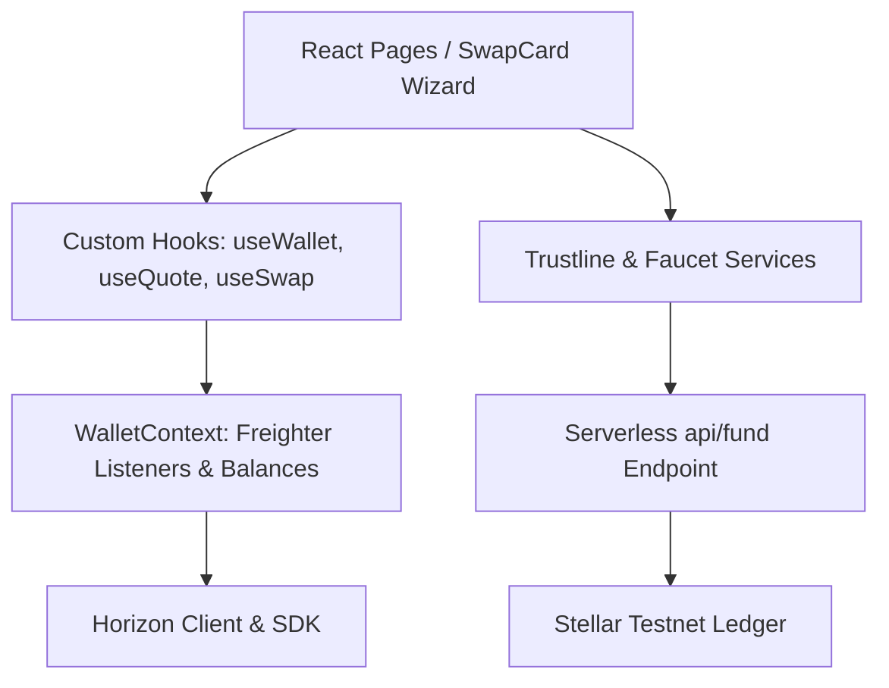

# StellarSwap — Premium Stellar Asset DEX Interface

StellarSwap is a premium decentralized exchange (DEX) interface built on the Stellar network. It provides a visual interface for connecting to Freighter Wallet, establishing custom token trustlines, claiming Testnet assets via faucet endpoints, and executing path payment swaps on the native Stellar DEX ledger.

---

## Technical Architecture

StellarSwap decouples UI presentation, React state flows, serverless faucet backends, and blockchain interactions to ensure security and maintainability:



### Decoupled Layers
1. **Presentation Layer**: React TSX pages ([Home](src/pages/Home.tsx), [Swap](src/pages/Swap.tsx)) styling Zinc 950 templates, vector overlays, and the step-by-step onboarding wizard.
2. **Assets & Trustline Services**: Wraps changeTrust operations ([trustline.ts](src/services/trustline.ts)) and faucet requests ([faucet.ts](src/services/faucet.ts)).
3. **Serverless Backend Faucet**: Securely executes payment transactions in Vercel functions ([api/fund.ts](api/fund.ts)) and Vite dev middleware ([vite.config.ts](vite.config.ts)) using distribution secret keys without exposing them to the React frontend.
4. **Horizon Service Layer**: Manages Horizon query payloads. Decodes status logs using mapped operation codes (`op_underfunded`, `op_no_trust`).
5. **DEX Liquidity Bootstrap Tooling**: Node.js scripts using esbuild (`tsx`) to instantiate bid/ask offers directly on the Native Stellar DEX, creating orderbooks that enable routing pathfinding.

---

## Tech Stack

* **Core**: React 19, TypeScript, Vite
* **Backend Functions**: Node.js, Vercel Serverless
* **Styling**: Tailwind CSS v4, Lucide Icons
* **Animations**: Anime.js, Framer Motion
* **Blockchain**: `@stellar/stellar-sdk`, `@stellar/freighter-api`
* **Test Runner**: Vitest

---

## Environment Variables

Configure parameters in your local environment file (`.env` or `.env.local`):

### Frontend Public Keys (Bundled)
| Variable Name | Description | Default Testnet Endpoint / Key |
| :--- | :--- | :--- |
| `VITE_STELLAR_NETWORK` | Target network identifier | `TESTNET` |
| `VITE_HORIZON_URL` | Horizon JSON API gateway | `https://horizon-testnet.stellar.org` |
| `VITE_RPC_URL` | Soroban contract RPC gateway | `https://soroban-testnet.stellar.org` |
| `VITE_USDC_ISSUER` | Project-owned USDC Issuer Key | Generated by setup script |
| `VITE_AQUA_ISSUER` | Project-owned AQUA Issuer Key | Generated by setup script |

### Backend Secret Keys (Never Exposed to Frontend)
| Variable Name | Description | Value |
| :--- | :--- | :--- |
| `USDC_DISTRIBUTION_SECRET` | USDC distribution secret seed | Generated by setup script |
| `AQUA_DISTRIBUTION_SECRET` | AQUA distribution secret seed | Generated by setup script |
| `USDC_ISSUER_SECRET` | USDC issuer secret seed | Generated by setup script |
| `AQUA_ISSUER_SECRET` | AQUA issuer secret seed | Generated by setup script |

---

## Bootstrapping Project Assets on Testnet

To create the asset ecosystem (Issuer and Distribution accounts), fund them with XLM, establish trustlines, and issue USDC/AQUA, execute the bootstrap setup script:

```bash
node scripts/manage-assets.js setup
```

This script will automatically:
1. Generate keypairs for the issuers and distributors.
2. Fund them via the Testnet Friendbot.
3. Establish distributor trustlines to issuers.
4. Issue 1,000,000 USDC and 1,000,000 AQUA.
5. Update your local `.env` with public keys and backend secrets.
6. Write secret keys securely to `scripts/assets-secrets.json` (ensure this is git-ignored).

---

## Bootstrapping Stellar DEX Liquidity & Orderbooks

Horizon pathfinding queries (`strictSendPaths()`) will fail unless active buy/sell offers exist on the decentralized exchange. To establish the orderbooks, define your target exchange rates inside `config/market.ts` (e.g. `USDC_PER_XLM: 5`, `AQUA_PER_XLM: 100`, `DEFAULT_SPREAD: 0.02`), and execute the bootstrap script:

```bash
npm run bootstrap-liquidity
```

This bootstrap script performs the following validation checks:
1. Verifies that the issuer accounts exist on the Testnet ledger.
2. Verifies distributor account balances.
3. Establish buy/sell offers on the native DEX (selling USDC for XLM, AQUA for XLM, and selling XLM for USDC and AQUA).
4. Verifies the orderbook asks and bids and checks that `strictSendPaths` routing paths are successfully resolved.

### DEX Diagnostics Commands
Run these diagnostics CLI commands to investigate orderbooks and asset states:

* **Verify active orderbook bid/asks and spreads**:
  ```bash
  npm run check-orderbook
  ```
* **Verify distributor token balances and offer IDs**:
  ```bash
  npm run check-liquidity
  ```
* **Test optimal pathfinding route results from Horizon**:
  ```bash
  npm run check-paths
  ```

---

## Running the Application Locally

1. **Install Dependencies**:
   ```bash
   npm install
   ```
2. **Launch Dev Server**:
   ```bash
   npm run dev
   ```
   *Note: In local development, Vite configuration intercepts `/api/fund` requests to simulate Vercel's serverless function backend using the secret keys in `.env`.*

3. **Open browser**: [http://localhost:5173/](http://localhost:5173/)

---

## Onboarding Demo Flow

The swap interface embeds a step-by-step onboarding wizard to guide new users:
1. **Connect Freighter**: Installs trustline permissions and checks current network.
2. **Create Trustline**: Builds a Freighter signature popup to add the USDC or AQUA trustline on the user's account.
3. **Claim Faucet Tokens**: Triggers the serverless `/api/fund` API to instantly send 100 USDC or AQUA to the user's Freighter address, refreshing balances automatically.
4. **Swap**: Unlocks the swap route payment pathfinder.

---

## Build, Formatting & Linting Checks

Verify production readiness before committing code:

* **Strict Linting**:
  ```bash
  npm run lint
  ```
* **Format Check**:
  ```bash
  npm run format:check
  ```
* **Unit Tests**:
  ```bash
  npm run test
  ```
* **Vite Production Bundler**:
  ```bash
  npm run build
  ```
